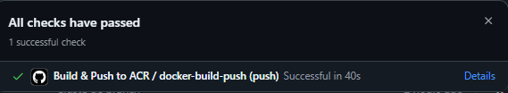
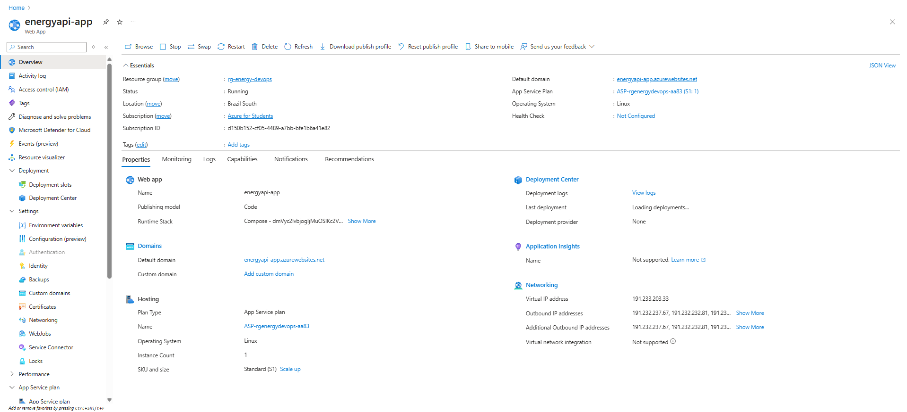
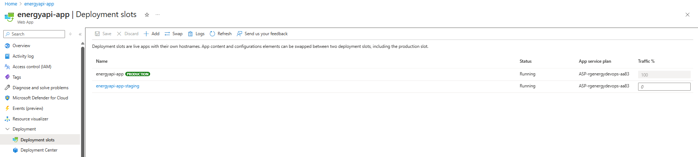
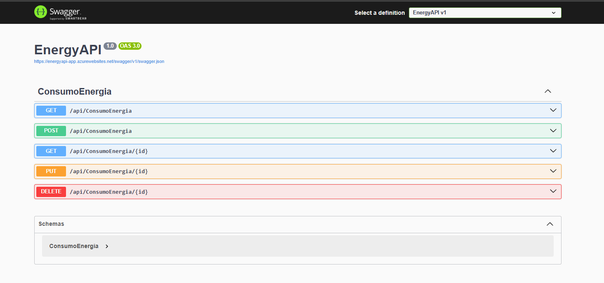

# EnergyAPI — DevOps (Docker + GitHub Actions + Azure)

API .NET 8 do projeto **EnergyAPI** empacotada em **Docker**, com **pipeline CI** (build/test) e **CD** via **GitHub Actions → Azure Container Registry (ACR) → Azure App Service (Linux)**.  
Ambientes utilizados para a entrega:

- **Staging (simulado)**: execução **local** via Docker Compose  
- **Produção (cloud)**: **Azure App Service** consumindo imagem do **ACR**  
  > Swagger público: **https://energyapi-app.azurewebsites.net/swagger**

---

## 📂 Estrutura do projeto

```
.
├─ EnergyAPI/                 # API .NET 8 (Web API)
│  ├─ Dockerfile
│  └─ ...
├─ EnergyAPI.Tests/           # Testes XUnit (um teste marcado como Skip para o CI)
├─ docker-compose.yml         # Compose local (API + SQL Server)
├─ docker-compose.deploy.yml  # Compose com overrides (se precisar)
├─ .env.example               # Variáveis de ambiente (local)
├─ .github/workflows/push-to-acr.yml   # CI/CD para Azure (ACR)
└─ README.md
```

---

## 🚀 Como executar localmente (Docker)

1. **Pré-requisitos**  
   - Docker Desktop (Windows/Mac) ou Docker + Docker Compose (Linux)

2. **Configurar variáveis**  
   ```bash
   cp .env.example .env
   # edite se quiser alterar senha/DB
   ```

3. **Subir containers**  
   ```bash
   docker compose --env-file .env up -d --build
   ```

4. **Acessar a API**  
   - Swagger: http://localhost:8080/swagger  
   - Logs rápidos:
     ```bash
     docker compose ps
     docker logs energy-api --tail=200
     ```

> **Obs.:** O Compose local sobe **API** (porta 8080) + **SQL Server** (contêiner `sqlserver-fiap`). O connection string é passado por variável `ConnectionStrings__DefaultConnection`.

---

## 🔄 Pipeline CI/CD

**Ferramenta**: **GitHub Actions**

### O que o pipeline faz
1. **Build & Test** (.NET 8)  
2. **Docker Build** da imagem da API  
3. **Push** da imagem para o **Azure Container Registry (ACR)**  
   - Tags: `latest` (e opcionalmente o SHA do commit)
4. **Deploy** no **Azure App Service** (configurado via Deployment Center para puxar a imagem do ACR)

### Arquivo do pipeline
`/.github/workflows/push-to-acr.yml` (gatilho em `push` na branch `main`)

Secrets necessários no repositório (**Settings → Secrets and variables → Actions**):

- `ACR_LOGIN_SERVER` → ex.: `acrenergydemo.azurecr.io`
- `ACR_USERNAME` → usuário admin do ACR
- `ACR_PASSWORD` → senha admin do ACR

> **Por que não ligamos o App Service ao repositório?**  
> O fluxo é **Repo → Actions → ACR**. O App Service puxa **só a imagem** do ACR (configurado no Deployment Center). Isso simplifica e deixa o deploy previsível.

---

## 🐳 Containerização

### Dockerfile (resumo)
- Base: `mcr.microsoft.com/dotnet/aspnet:8.0` (runtime) + `mcr.microsoft.com/dotnet/sdk:8.0` (build)
- Expõe **porta 8080**
- Usa `ASPNETCORE_URLS=http://0.0.0.0:8080`

### Variáveis importantes
- `ASPNETCORE_URLS` = `http://0.0.0.0:8080`
- `WEBSITES_PORT` = `8080` (Azure)
- `ConnectionStrings__DefaultConnection` (connection string da API)

---

## ☁️ Deploy na Azure (produção)

### Recursos usados
- **Azure Container Registry (ACR)**: armazena a imagem `energyapi:latest`
- **Azure App Service (Linux)**: puxa a imagem do ACR e sobe o container

### Passos (resumo)
1. **ACR** criado (`acrenergydemo`) com **Admin User** habilitado  
2. **Secrets** no GitHub (`ACR_LOGIN_SERVER`, `ACR_USERNAME`, `ACR_PASSWORD`)  
3. **Actions** gera e envia `energyapi:latest` para o ACR  
4. No App Service (**Deployment Center**):
   - **Source**: *Container Registry*
   - **Container type**: *Single Container* (recomendado no plano B1)
   - **Registry source**: *Azure Container Registry*
   - **Registry**: `acrenergydemo`
   - **Image**: `energyapi`
   - **Tag**: `latest`
5. **Configuration** (App Service → Configuration → Application settings):
   - `ASPNETCORE_URLS = http://0.0.0.0:8080`
   - `WEBSITES_PORT = 8080`
   - (Para exibir Swagger em prod na apresentação) `ASPNETCORE_ENVIRONMENT = Development`
6. **Restart** do App Service
7. **Acessar**: https://energyapi-app.azurewebsites.net/swagger


---

## 🧪 Testes

- Projeto: `EnergyAPI.Tests/`
- Há um teste de integração que tentava bater em `http://localhost:<porta>`.  
  Para o CI não falhar, ele está **marcado como `Skip`**:
  ```csharp
  [Fact(Skip = "Ignorado no CI: não sobe API local durante o pipeline")]
  public async Task Get_ReturnsHttpStatusCode200() { ... }
  ```
- Melhor prática (futuro): usar **`WebApplicationFactory<Program>`** e **EF InMemory** para rodar sem rede.

---

## 🖼️ Prints do funcionamento (evidências)

Inclua no README/PDF:
- ✅ Ação do GitHub Actions concluída (jobs verdes)

- ✅ App Service rodando (tela do Deployment Center ou *Overview* com “Running”)
 / 
- ✅ Swagger aberto: `https://energyapi-app.azurewebsites.net/swagger`


---

## 🛠️ Tecnologias utilizadas

- **.NET 8** (ASP.NET Core Web API)
- **Docker** e **Docker Compose**
- **GitHub Actions** (CI/CD)
- **Azure Container Registry (ACR)**
- **Azure App Service (Linux)**

---

## 🧯 Troubleshooting rápido

- **App Service dá “Application Error”**  
  - Verifique **Deployment Center → Logs**  
  - Confirme imagem `energyapi:latest` existe no **ACR**  
  - Confirme **auth**: *Admin Credentials* ou role **AcrPull** para o App Service  
  - Garanta `ASPNETCORE_URLS` e `WEBSITES_PORT` configurados

- **Swagger 404 na Azure**  
  - Setar `ASPNETCORE_ENVIRONMENT=Development` no App Service **ou** habilitar `UseSwagger()` também em produção no `Program.cs`.

- **Teste falhando no Actions por porta local**  
  - Deixe como `Skip` (entrega)  
  - Ou reescreva com `WebApplicationFactory` (boa prática)

---

## ✅ Checklist de Entrega

- [x] Projeto compactado em .ZIP com estrutura organizada  
- [x] Dockerfile funcional (porta 8080)  
- [x] `docker-compose.yml` (local) e/ou Compose de deploy  
- [x] Pipeline com **build**, **test** e **push para o ACR**  
- [x] **Deploy** no Azure App Service (puxando imagem do ACR)  
- [x] README com instruções e prints  
- [x] Documentação técnica (PDF/PPT) com evidências  
- [x] Ambientes: **Staging (local)** e **Produção (Azure)**

---

## 📜 Licença
Uso acadêmico/educacional.
